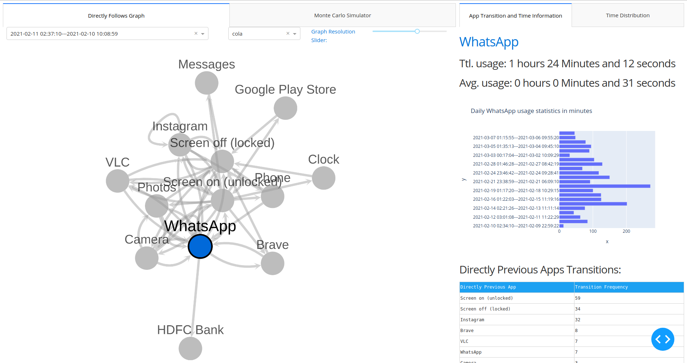

# Process Mining for Android App Activity
Process Mining is "Mining" actionable information from event logs. One such actionable information is the directly follows graph (DFG). This project is particularly aligned to process mining for Android App usage logs. However, with minor changes, process mining here can be generalized for any event log such as website visits, e-transactions and more.

# DFG Options:

## Time Dropdown:
- `All` will create the DFG for the whole timespam of the csv logfile. 
- Other options in the DFG dropdown contain timeperiods of activity discovered using break time of 5 hours (Change this in `config.ini`). Break span is used to seggregate discrete processes within the continuous logfile. Ideally, set it less than the number of hours you sleep. 

## Layout Dropdown:
- DFG can be plotted using various layouts.
- Visit the [Official Dash Documentation](https://dash.plotly.com/cytoscape/layout) for a list of such layouts.
- `cola` is really good for analyzing small graphs.
- `circle` and `breadthefirst` are best for large graphs.

## Graph Resolution Slider
- Slider with value `x` between 0 to 100 will display the DFG after only including edges with frequency greater than the `xth` percentile of all edge weight data. 
- Resolution of `0` will display only the maximum frequency edges while the resolution of `100` will display all edges.
- Note: Nodes with no edges are automatically removed.

# Monte Carlo Simulator:
- Create a directed graph for transitions between apps with edge weight as probabilities derrived using past data.
- Choose a starting node (`N_S`) (`Screen on (unlocked)` by default), Ending node (`N_E`) (`Screen off (locked)` by default) and number of monte carlo simulations (`n`).
- Starting from `N_S` probabilistically traverse the graph until `N_E` is reached or 100 hops done.
- Repeat above for `n` times
- Print out the paths with their monte carlo path confidence levels
- Fun: `How irrational are you?:` slider varies from 0 to 1 and determines how often must the transitions be made completely randomly as opposed to based on probabilities computed using past behavioral data.
- See `monte_carlo_simulation.py` for more details.

# How?
1. Install `requirements.txt` using pip
2. Modify the logfile location in `config.ini`
3. Run `app.py`
4. Open `http://127.0.0.1:8050/` on browser to visit the dash dashboard.

# How to get the logfile?
- I used this [app on Playstore](https://play.google.com/store/apps/details?id=com.a0soft.gphone.uninstaller&hl=en_IN&gl=US). Export activity data as csv.
- No formatting required, in case you have a different source, modify the `load_data` function in `pm.py`. 

# Todo:
- DFG
- Global and Local stats
- Charts
- Dash dashboard
- Monte Carlo Simulator
- Process Model Conformance checking for temporal behaviour variance analysis
- Trace analysis

# Warning:
This isn't a very documented or planned project. It was meant for my own understanding of process mining and learning to use Dash. Be sceptic of everything here and do not use this in production (or do it post heavy scrutiny).

# Note:
I can't write beautiful css. Hence, the `assets` folder is stolen from the [official dash cytoscape project](https://github.com/plotly/dash-cytoscape).